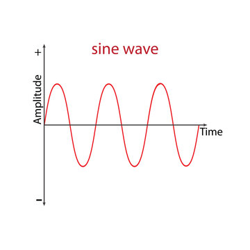

# atan0799_9103_tut1
# Individual Project – Animated Line Composition Based on Nasreen Mohamedi’s 'Untitled-1'

## Interactive Instructions

To explore the work:

- Open the `index.html` file in your browser.
- The screen will load a line-based abstract composition.
- Over time, line modules will gradually **fade in and out** in a **breathing rhythm**.
- Each group of lines appears **sequentially**, giving a layered construction feel.

No interaction is needed – the experience is entirely **time-driven** and ambient. For best effect, view in full screen.

## My Individual Animation Approach

I designed a **rhythmic animation** inspired by **breathing** and **heartbeat monitors**. The goal was to give the static line drawing a sense of **life** and **calm pulsation**.

### Chosen driver: `Time`

I chose to use a **time-based sine wave** (`sin(frameCount * speed)`) to animate the visuals. Unlike audio or user interaction, this allows for a consistent meditative rhythm without user input.

## What Gets Animated & How

**Two key properties** of the line composition are animated:

1. **Alpha (Opacity):**  
   - Each group of lines slowly fades in and out.
   - Driven by a `sin()` wave mapped between low and high alpha values.

2. **Stroke Weight:**  
   - Line thickness subtly varies over time to create a “breathing” or “pulsing” effect.

Additionally, I introduced a **staggered delay** for each module:
- Every group of lines appears at a **different time**, not all at once.
- This creates a rhythm of **construction**, with the image forming gradually.

 **Uniqueness from Group Members:**  
While others in the group may use mouse interaction, Perlin noise, or sound, my animation is **purely time-driven**, rhythm-focused, and emphasizes **emergent layering**.

## Visual Inspiration

## Technical Implementation

- `sin(frameCount * breathingSpeed)` provides a smooth breathing rhythm.
- `map()` functions translate `sin` output into:
  - Alpha values: `map(breath, -1, 1, 80, 200)`
  - Line weight: `map(breath, -1, 1, 0.5, 2.5)`
- A `modules[]` array stores all grouped drawing functions (`module1` to `module16`).
- Each group’s appearance is delayed via `frameCount - i * delayFrames`.

The breathing cycle takes ~6 seconds per wave, simulating a calming breath cycle.

## Changes to Group Code

- Split the master `drawModules()` into 16 separate modular functions (`module1` to `module16`).
- Replaced single draw call with delayed looped drawing (`for (i in modules)`).
- Added `sin()`-based modulation and mapped it to stroke weight and alpha.
- Ensured drawing logic is responsive to window size using `scaleFactor`.

## External References & Techniques

- [p5.js sin() Reference](https://p5js.org/reference/p5/sin/) – used to create the breathing rhythm.
- [MDN map() Logic](https://developer.mozilla.org/en-US/docs/Web/JavaScript/Reference/Global_Objects/Math) – used to remap sin outputs to stroke values.

All code is commented thoroughly with:
- Group-level structure annotations
- Per-function explanations for both drawing and animation logic
